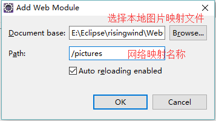
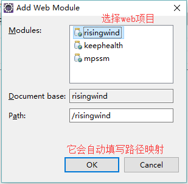
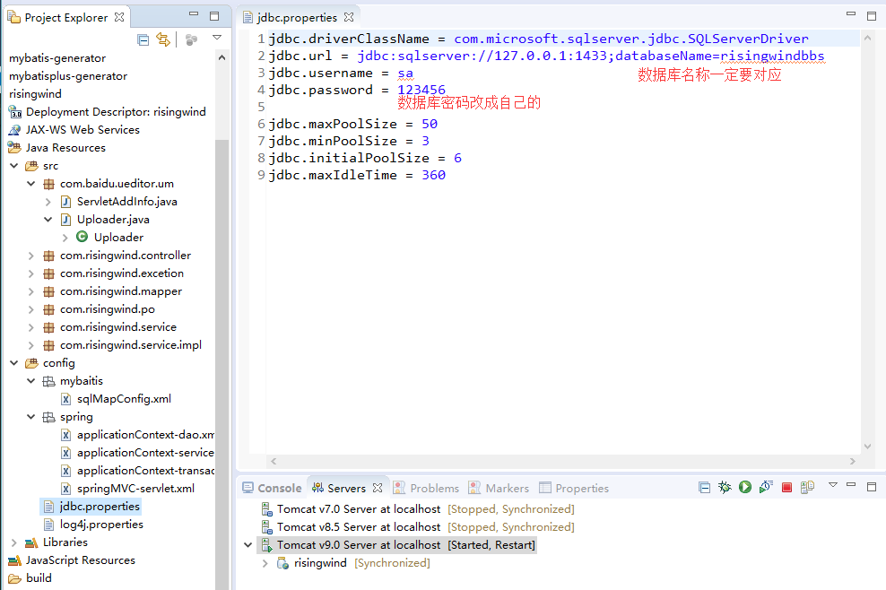

# 新手BBS项目SpringMVC+MyBatis+JSP - risingwind  翼风之下-社区论坛 （仿MIUI论坛）

* BBS项目-翼风之下社区论坛
* 开始时间：2017-10-14 ，完成时间：2017-11-30
* 组长：李
* 小组成员：卢 ，黄 ，于 ，杨
* 翼风之下 社区论坛，由 String MVC+Mybatis 搭建，页面主要由Bootstrap编写。作为SSM实战项目。

## BBS系统需求分析

主要实现了基于B/S模式客户端和服务器端的动态交互。
- 开发BBS论坛系统的目的是提供一个供用户交流的平台，为广大用户提供交流经验、探讨问题的网上社区。
- BBS论坛系统最基本的功能首先是发表主题，其次是其他人员根据主题发表自己的看法。此外，为了记录主题的发表者和主题的回复者信息，系统还需要提供用户注册和登录的功能。只有注册的用户登录后才能够发表和回复主题，浏览者（游客）只能浏览主题信息。

## 项目部署

1. pc操作系统
2. java环境1.8
3. Sqlserver2014数据库
4. eclipse、支持Tomcat9最好
5. 把项目导入eclipse（环境不同可能回报错，但问题不大。可以新建空web项目后粘贴过去）
6. sql脚本文件和pictures本地图片文件夹同时放在WebContent文件夹下，理解目录结构的可以自行变动

如果 `config` 文件夹不像 `项目结构` 那样，就需要在 `config` 右击选择 `Build Path` => `Use as Source Folder` 添加，否则加载不到配置文件。

#### 1.在 Java Build Path 中

Libraries会这几个库，一般导入时jsp会报错，都是少了Tomcat这个Library，在右边按钮选择第四项 Add Library 找到Server Runtime前提要先在service中添加Tomcat服务。

#### 2.项目没有问题了，把项目部署到Tomcat上

项目还应用到本地图片上传显示，所以会把一个文件夹映射成网络路径。双击Tomcatserver弹出窗下方标签选择Modules，在Web Modules中

#### 3.接下来到Sqlserver2014数据库数据导入

1. 项目的sql脚本，直接导入
2. （如果直接导入失败可能是版本兼容问题，一般脚本影响不大）新建数据库risingwind，新建查询，将sql脚本贴入编辑窗执行
3. risingwind数据库会显示几张表

#### 4.更改项目数据源，启动Tomcat

改好后，启动Tomcat。（一般项目没有红色叉，黄色叹就可以运行成功）

#### 5.成功访问首页

